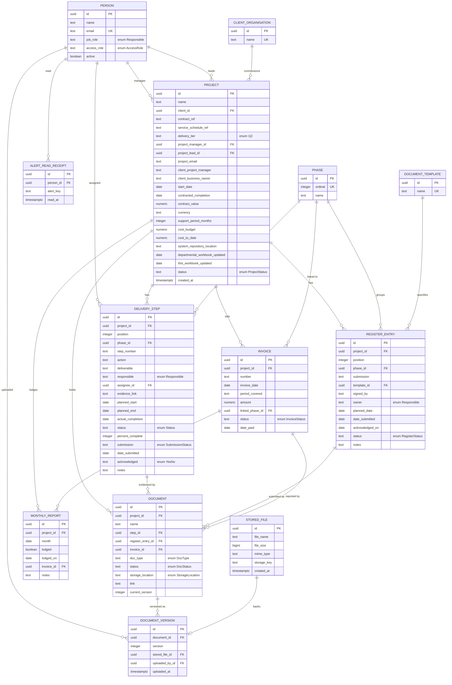

# Data Model — DRAFT PROPOSAL

**Status: DECISIONS APPLIED — 2026-09-10.**

All nine open decisions in §1 have been answered by the product owner. Each is marked
in place with its answer. `PHASE-0-DECISIONS.md` carries the reasoning and the
follow-on work; this document carries the resulting schema.

Two answers changed this document rather than merely confirming it: **ERD-D6**
reversed the draft's assumed default, and **ERD-D4** added a SharePoint integration
that was in no plan.

Derived 2026-09-10 from `FRONTEND-INVENTORY.md` (same repo, same commit `26ddc67`)
and from re-reading the declarations that inventory points at. This document exists
to be argued with at the ERD review. A draft that reads as a decision gets built
without the review that is the entire point of Phase 0.

---

## 0. Preamble

**Input.** `FRONTEND-INVENTORY.md` at the repo root, produced by `frontend-extractor`,
well-formed and complete against its own contract. Its §0 reports wiring state
**NOT WIRED**, so per the authority order the client persistence layer is the whole
contract — except that §3 reports there *is* no persistence layer. Authority therefore
falls to the two places the inventory nominates in its headline: the reducer's 27
actions (`src/store/AppStore.tsx:10-37`) and the type declarations (`src/types.ts`).

I did not work from the inventory's census alone. Every column below was read from
its declaration; every reference field had its **values sampled** rather than its name
trusted. Where that reading contradicted the inventory, §9 says so.

**Conventions.** `snake_case` tables and columns, against the frontend's `camelCase` —
a translation layer is assumed and is a decision in its own right if the team prefers
otherwise. Types are written generically (`text`, `integer`, `numeric`, `date`,
`timestamptz`, `boolean`, `uuid`); **no database engine is assumed** and no DDL is
offered. No indexes are proposed — there is no query load yet to justify one.

**Marking.** Columns present in a source declaration are unmarked. Columns that exist
in no source type — implied by nesting, by a junction, or by a constraint the frontend
could not express — are marked **`[inferred]`**. Roughly a third of the foreign keys
below are inferred, and they are the likeliest place this draft is wrong.

---

## 1. Decisions — ALL ANSWERED

Answered in session 2026-09-10. The reasoning on both sides is kept below because it
records *why* each was decided, not only what. Each heading now carries its answer.

### D1 — Is `person` one table, or are client-side people a second population?

> **ANSWERED: one table. Client-side people stay as free text on `project`.**
> Confirms the draft's default. No `client_contact` table. Note the deliberate asymmetry
> with D7: client *organisations* became a managed list, client *people* did not.

**What moves:** `project` loses or keeps two columns; a new table and its FKs appear or
do not; every future "who touched this" question either can or cannot reach client staff.

The internal roster is one clean identity space: 11 people, ids `u1`–`u11`, single
prefix, no fragmentation, no competing self-view/staff-view pair. That half is settled.

But `Project.clientProjectManager` and `Project.clientBusinessOwner` (`types.ts:144-145`)
hold **bare name strings for eight real, named individuals** who appear nowhere in
`PEOPLE`: `Mpho Radebe`, `Nomvula Khoza`, `Refilwe Sekgobela`, `Sr Beatrice Mathebula`,
`Dr Anusha Naidoo`, `Dr Sizwe Mahlangu`, `Adv. Peter Coetzee`, `Mr Deon Fourie`
(`seed.ts`). Honorifics and full names — these are people the business tracks, stored as
free text. Per catalogue 6.5, a bare name on an entity is a foreign key nobody modelled.

| For a separate `client_contact` table | Against |
|---|---|
| Eight distinct named humans, not roles | They never log in — no email, no access role, no credential |
| The business plainly cares who they are | Referenced from exactly two columns on one table |
| A department will have many projects over time, and the same contact will recur | Zero recurrence in the seed — n=1 per project, so no evidence of reuse |
| Contact details will be wanted (the app has none today) | Adds a table and a join for what is currently display-only text |

**Default assumed:** keep them as free-text columns on `project`, and flag the
promotion as a known future migration. This is the conservative choice and it is
reversible; the reverse is not.

### D2 — Does a `phase` lookup table exist, or do phases stay strings?

> **ANSWERED: yes, the `phase` table exists.** Confirms the draft's default.
> All three phase columns become foreign keys, which removes the `startsWith` prefix join.

**What moves:** three tables' columns change type, and a genuinely fragile join is
either fixed or inherited.

**There are three different string representations of one concept in the codebase:**

| Column | Stored form | Source |
|---|---|---|
| `DeliveryStep.phase` | `"1 Initiation"` — ordinal **and** name | `templates.ts:23+` |
| `RegisterEntry.phase` | `"2"` — ordinal **only** | `templates.ts:81+` |
| `Invoice.linkedPhase` | `"2 Planning"` — ordinal **and** name | `seed.ts` |

They are joined by **string prefix matching**: `scheduleRegister` does
`steps.filter(s => s.phase.startsWith(\`${e.phase} \`))` (`factory.ts:80`), and
`register/insert` derives the register's form by `action.phase.split(' ')[0]`
(`AppStore.tsx:151`). Rename a phase and that join silently returns nothing.

Per catalogue 6.15 this is an enum whose members carry an attribute — the ordinal is
load-bearing (it sorts the plan, and `phaseReached` walks it) and the name is display.
A member with attributes is a row.

| For a `phase` lookup table | Against |
|---|---|
| Fixes a prefix-match join that breaks on rename | The set is closed, ordered and has changed rarely — an enum is simpler |
| Reconciles three representations into one FK | Three tables gain a join for a value that is always rendered whole |
| Phases already carry an ordinal used for ordering | The 10 values are hardcoded in `reference.ts:4-8` and treated as constant |

**Default assumed:** a `phase` lookup table with `ordinal` + `name`, and all three
columns become `phase_id`. This is the one structural change I would argue for hardest,
because the current join is not merely inelegant — it is incorrect under rename.

### D3 — How does a document attach to its subject: polymorphic pair, or typed FKs?

> **ANSWERED: Option B — three nullable typed FKs, with at most one set.**
> **And zero is permitted:** a document may stand alone at project level, which a signed
> contract does. The CHECK below is therefore `at most one`, not `exactly one`.

**What moves:** the shape of the `document` table and every constraint on it.

`DocumentRecord` carries three nullable FKs — `stepId`, `registerEntryId`, `invoiceId`
(`types.ts:96-100`) — which the comments show are meant to be **mutually exclusive**:
a file is evidence for a step, *or* the register's submission, *or* an invoice's
progress report. Nothing in the type or any code enforces exclusivity. Catalogue 6.9,
and I am instructed not to pick:

| Option A — discriminated pair | Option B — three nullable typed FKs |
|---|---|
| `subject_type` + `subject_id` | `step_id`, `register_entry_id`, `invoice_id` |
| One column pair, extends to new subjects free | Real referential integrity on every link |
| **No FK integrity** — the DB cannot check `subject_id` | Wider table; a new subject type means a migration |
| Needs application-level validation | Needs a CHECK that exactly one is non-null |

**Default assumed for the diagram:** Option B, because it preserves integrity and
because the three delete behaviours already **differ** per link (see D-note below) —
which a single polymorphic pair cannot express without application logic.

**A related fact the reviewer should see:** the three links already have *different*
delete semantics in the reducer. `step/delete` and `register/delete` **null** the link
(`AppStore.tsx:123`, `:160-161`); `invoice/delete` **hard-deletes the document**
(`:201`). Three links, two policies. Whether that asymmetry is intended is itself a
question — it may simply be that an invoice's progress report has no meaning without
the invoice, while evidence outlives its step.

### D4 — Is there a `stored_file` table at all, or do files stay in SharePoint?

> **ANSWERED: BOTH — and this expands the draft.** Azure Blob Storage holds the bytes,
> so `stored_file` exists as drafted. **SharePoint remains document management, and
> uploads are pushed to it automatically.** That integration appears in no upstream plan.
> Five follow-on questions are open — see `PHASE-0-DECISIONS.md` under ERD-D4.

**What moves:** whether the documents subject area is two tables or three, and whether
the backend takes on file storage at all.

The inventory (§8) reports upload is a real control encoding to in-memory
`URL.createObjectURL` — no transport. But `Project` also carries three free-text
location fields, and the seed fills them with **real SharePoint paths**:
`'SharePoint › Rewatu › Vulindlela › 01 Working'` (`seed.ts`). So files live in
SharePoint *today*, and the app records where.

| For a `stored_file` table + real storage | Against |
|---|---|
| `DocumentVersion` already carries `fileName`, `fileSize`, `mimeType` — file metadata with no file | The business already has document storage that works |
| The three gates (§9 of the inventory) require an attached file to exist | Duplicating SharePoint invites two sources of truth |
| Version history is modelled and would be lost against a bare link | `DocumentRecord.link` and `evidenceLink` already hold external URLs |

**Default assumed:** `stored_file` exists as a table, because `document_version`'s
metadata columns are otherwise orphaned and the completion gates need a checkable
referent. But this is genuinely open and it is a product decision, not a schema one.

### D5 — Temporal representation, and the timezone question

> **ANSWERED: South African time (SAST), evaluated server-side.** Confirms the draft's
> default. Everyone at Rewatu and every client department is in SA. SAST is UTC+2 with
> no daylight saving, which is why this was cheap; that is the assumption that breaks
> if Rewatu ever works in another country.

**What moves:** roughly 25 columns across 6 tables.

Every date in the frontend is `ISODate = string`, `YYYY-MM-DD`, and — pervasively —
**empty string means "not set"** (`types.ts:19-20`). Two exceptions:
`DocumentVersion.uploadedAt` and `Project.createdAt` are full ISO timestamps
(`types.ts:86`, `:164`), and `MonthlyReport.month` is `YYYY-MM` (`types.ts:125`).

Proposal: `date` for the `YYYY-MM-DD` fields with **`NULL` for not-set**, `timestamptz`
for the two timestamps, and `month` as either a `date` pinned to the first of the month
or a `(year, month)` pair.

**The timezone decision cannot be deferred and no fixture will answer it.** Every
overdue, due-soon and health calculation compares against `today()` taken from the
client (`derive.ts`, `now = today()` defaults throughout). A South African business
operating in SAST (UTC+2, no DST) makes this easier than most — but "easier" is not
"decided", and the answer must be written down before the first date column is created.

**Default assumed:** store `date` as a plain calendar date (no zone), timestamps as
`timestamptz`, and evaluate all "is it overdue" rules **server-side in SAST**.

### D6 — `'Not applicable'` as a submission status: add it, or delete the branch?

> **ANSWERED: delete the branch. This REVERSES the draft's assumed default.**
> `SubmissionStatus` keeps its **six** documented members. `'Not applicable'` is not
> added. The `derive.ts:40` branch — and the cast to `string` that made it possible —
> is dead code and is removed. `'Not applicable'` remains valid on `delivery_step.status`
> and `delivery_step.acknowledged`, where it means something different and real.

**What moves:** one enum, but it sits inside the rule the README calls the one the
whole system exists for.

The inventory's finding 6 (adopted, not re-derived): `SUBMISSION_STATUS`
(`reference.ts:18-20`) has six members and **does not include** `'Not applicable'`, yet
`stepFlag` casts the field to `string` to compare against it (`derive.ts:40`). The cast
is only necessary because the type forbids the value. `REGISTER_STATUS` and `YES_NO`
both *do* include it.

Per catalogue 6.8 there is a second question underneath: `'Not applicable'` and
`'Not required'` may be **two names for one state**, in which case the model should
carry one of them, not both.

**Default assumed:** the seven-member union — treat `stepFlag`'s branch as evidence
that production data will contain the value. But this needs a human who knows the
business to say whether `'Not required'` and `'Not applicable'` differ.

### D7 — Is `client` an organisation entity?

> **ANSWERED: yes.** `client_organisation` is confirmed, not conditional — despite being
> the draft's own weakest proposal (§9 ranked it first). Decided on domain grounds:
> Rewatu works with the same departments repeatedly and needs to total work per department.

**What moves:** one lookup table, one FK on `project`.

`Project.client` is free text holding four South African national departments —
`Department of Basic Education`, `Department of Health`, `Department of Science,
Technology and Innovation`, `Department of Small Business Development` (`seed.ts`).
One project each in the seed, so **no repetition is observable**, but a consultancy
plainly has many projects per department over time.

**Default assumed:** a `client_organisation` lookup with `project.client_id`. The
evidence is weak (n=1 each) and I flag it as the proposal I would drop first.

### D8 — Soft delete or hard delete for `person`?

> **ANSWERED: soft delete. Deactivation is the supported path.** Confirms the draft's
> default. An inactive person is **locked out entirely** — see `AZ-D2`. Hard delete is
> reserved for a person added in error who has touched nothing.

**What moves:** whether `person/delete` needs the cascade policy the inventory's
finding 4 says is missing.

`Person.active` already exists (`types.ts:37`) **and has a working toggle** —
Deactivate/Reactivate in Settings dispatching `person/update` (`Settings.tsx:257`).
Alongside it, `person/delete` removes the row with no cascade at all, orphaning
`assigneeId`, `projectManagerId` and `projectLeadId`.

**Default assumed:** deactivation is the real operation, hard delete is restricted to
never-referenced rows, and `person.active` becomes the supported path. This makes the
inventory's finding 4 largely moot rather than requiring a cascade design.

### D9 — Project archiving: build the write path, or drop the column?

> **ANSWERED: build it — and it becomes the ONLY disposal route.** Projects are never
> deleted. This expands the draft: the project delete operation is removed entirely, so
> the five-table cascade documented in §3.2 will never be triggered.
> Open: who may archive, and what happens to a project created by mistake.

`Project.archived` is **read in eight places** to filter projects out
(`permissions.ts:40`, `alerts.ts:71`, `tasks.ts:67`, `calendar.ts:48`, `TopBar.tsx:58`,
`DocumentsView.tsx:80`, `MyTasks.tsx:42`, plus `derive.ts`) and is set to `false` at
its three construction sites (`seed.ts:73`, `factory.ts:95`, `NewProjectWizard.tsx:133`).
**Nothing anywhere sets it to `true`.** Archiving is filtered-for everywhere and
unreachable.

**Default assumed:** the column is real and the write path is simply unbuilt. Keep it.

---

## 2. The model

**Not shown on the diagram:** the audit columns added by decision **AZ-D7** —
`created_by`, `created_at`, `updated_by`, `updated_at` on `project`, `delivery_step`,
`register_entry`, `invoice` and `monthly_report`, with each `*_by` a foreign key to
`person`. They are listed in §3. Drawing nineteen more edges into `PERSON` would make
the diagram unreadable without telling the reader anything it does not already say.

**Also not shown:** `project` has no delete path. Archiving is the only disposal
route (ERD-D9).

---

## 3. Tables

### 3.1 Identity and reference

#### `person`
Source: `src/types.ts:29-38`. Seeded 11 rows, `seed.ts:18-30`.

| Column | Type | Null | Notes |
|---|---|---|---|
| `id` | uuid | no | PK. Replaces `u1`–`u11` — see hazard H1 |
| `name` | text | no | `types.ts:31` |
| `email` | text | no | `types.ts:32`. **UNIQUE `[inferred]`** — all 11 distinct `@rewatu.co.za`; nothing in the frontend enforces it |
| `job_role` | enum `Responsible` | no | `types.ts:34`. The job they do; drives responsible-party lists |
| `access_role` | enum `AccessRole` | no | `types.ts:36`. What they may see and change |
| `active` | boolean | no | `types.ts:37`, default `true`. Toggled at `Settings.tsx:257` |

`job_role` and `access_role` are **two distinct vocabularies on one row** and must not
be merged — inventory finding 10, adopted. They share three member spellings
(`Project manager`, `Project lead`, `Director`) but are different axes.

Authentication columns are deliberately **not** proposed here. Nothing in the frontend
carries a credential, session or token (inventory §4), and the authorization model is
the next skill's subject. Whether credentials live on `person` or in a separate
`user_account` is a Phase-0 decision I am leaving to it rather than pre-empting.

#### `client_organisation` — **proposed, see D7**
Source: `Project.client` free text, `types.ts:136`.

| Column | Type | Null | Notes |
|---|---|---|---|
| `id` | uuid | no | PK **`[inferred]`** |
| `name` | text | no | UNIQUE **`[inferred]`**. Four values in seed |

#### `phase` — **proposed, see D2**
Source: `PHASES`, `reference.ts:4-8`. Ten rows, fixed.

| Column | Type | Null | Notes |
|---|---|---|---|
| `id` | uuid | no | PK **`[inferred]`** |
| `ordinal` | integer | no | UNIQUE **`[inferred]`**. `1`–`10`. Load-bearing: orders the plan and drives `phaseReached` (`derive.ts:350`) |
| `name` | text | no | `Initiation`, `Planning`, … — the name **without** the ordinal prefix |

The current strings concatenate these two (`"1 Initiation"`). Splitting them is the
point: it removes the `startsWith` prefix join.

#### `document_template` — **proposed, undeclared entity (step 7)**
Source: `RegisterEntry.template` free text, `types.ts:70`; 18 distinct values in
`templates.ts:81+`, several repeated (`Template 02` ×3, `Template 03` ×2,
`Template 07 and Annexure A` ×2).

| Column | Type | Null | Notes |
|---|---|---|---|
| `id` | uuid | no | PK **`[inferred]`** |
| `name` | text | no | UNIQUE **`[inferred]`** |

This is a real catalogue — `Template 01`–`Template 09`, `Appendix A`/`B`/`C`,
`Meeting Minutes Template`, `Monthly Report Template` — mixed with genuinely free-form
entries (`Own format, per the TOR`, `Per the standard`). Those two are the argument
against the table, and a `NULL` template with free text alongside may be the honest
shape. Flagged rather than resolved.

### 3.2 Core delivery

#### `project`
Source: `src/types.ts:133-165` — 26 fields, the widest entity.

| Column | Type | Null | Notes |
|---|---|---|---|
| `id` | uuid | no | PK |
| `name` | text | no | `:135` |
| `client_id` | uuid | yes | FK → `client_organisation` **`[inferred]`, see D7**. Today free text `:136` |
| `contract_ref` | text | yes | `:137` |
| `service_schedule_ref` | text | yes | `:138` |
| `delivery_tier` | enum `'1'\|'2'` | no | `:139` |
| `project_manager_id` | uuid | yes | FK → `person` `:141` |
| `project_lead_id` | uuid | yes | FK → `person` `:142` |
| `project_email` | text | yes | `:143`. Empty in 1 of 4 seeded |
| `client_project_manager` | text | yes | `:144` — **an unmodelled person, see D1** |
| `client_business_owner` | text | yes | `:145` — **an unmodelled person, see D1** |
| `start_date` | date | yes | `:147` |
| `contracted_completion` | date | yes | `:148` |
| `contract_value` | numeric | no | `:149`. **Money — role-restricted, see §3.6** |
| `currency` | text | no | `:150`. `'ZAR'` at every site incl. the factory default (`factory.ts:91`) |
| `support_period_months` | integer | no | `:151`. Default 12 |
| `cost_budget` | numeric | yes | `:152`, genuinely nullable. **Money** |
| `cost_to_date` | numeric | yes | `:154`, genuinely nullable. **Money** |
| `system_repository_location` | text | yes | `:156`. **Kept** — this is the code repository, not document filing |
| `departmental_workbook_updated` | date | yes | `:160`. Drives the "stale workbook" alert |
| `this_workbook_updated` | date | yes | `:161` |
| `status` | enum `ProjectStatus` | no | **Replaces `archived` (N6).** `active` \| `archived` \| `cancelled`. Default `active` |
| `created_at` | timestamptz | no | `:164` |
| `created_by` | uuid | yes | FK → `person` **`[inferred]`** — AZ-D7. Null on rows migrated from the mock |
| `updated_by` | uuid | yes | FK → `person` **`[inferred]`** — AZ-D7. Last person to change the row |
| `updated_at` | timestamptz | no | **`[inferred]`** — AZ-D7 |

**Changed after the frontend, by decision:**
- `archived` (boolean) became `status` (three-member enum) — **N6**. A project created in
  error is `cancelled`, which reporting excludes by default; `archived` keeps its meaning
  of real work, finished. The eight places reading `!p.archived` become `status = 'active'`.
- `working_document_location` and `approved_document_location` were **dropped** — **N4**.
  The app now derives its own SharePoint folder per project, so a free-text path is no
  longer the setting. That folder convention is a design decision nobody has made yet.

`cost_budget` and `cost_to_date` are the only two source fields already declared
`number | null` rather than using the empty-string convention — the frontend
distinguishes "not captured" from zero here, deliberately (README).

#### `delivery_step`
Source: `src/types.ts:40-62`. 55 rows per project from the standard template.

| Column | Type | Null | Notes |
|---|---|---|---|
| `id` | uuid | no | PK |
| `project_id` | uuid | no | FK → `project`, **ON DELETE CASCADE** (`AppStore.tsx:68`) |
| `position` | integer | no | `order` renamed — `order` is reserved in SQL. See hazard H4 |
| `phase_id` | uuid | no | FK → `phase` **`[inferred]`, see D2**. Today a string `:45` |
| `step_number` | text | no | `step` renamed for clarity `:46`. **NOT unique** — see below |
| `action` | text | yes | `:47`. Empty action ⇒ blank flag (`derive.ts:36`) |
| `deliverable` | text | yes | `:48` |
| `responsible` | enum `Responsible` | yes | `:49`. `''` in source ⇒ NULL |
| `assignee_id` | uuid | yes | FK → `person` `:51`. **Confers project membership** (`permissions.ts:35`) |
| `evidence_link` | text | yes | `:52`. Free-text URL |
| `planned_start` | date | yes | `:53` |
| `planned_end` | date | yes | `:54`. Drives Overdue / Due soon |
| `actual_completion` | date | yes | `:55` |
| `status` | enum `Status` | no | `:56` |
| `percent_complete` | integer | no | `:57`. Default 0. **CHECK 0–100 `[inferred]`** |
| `submission` | enum `SubmissionStatus` | no | `:58`. **See D6** |
| `date_submitted` | date | yes | `:59` |
| `acknowledged` | enum `YesNo` | no | `:60` |
| `notes` | text | yes | `:61` |
| `created_by` | uuid | yes | FK → `person` **`[inferred]`** — AZ-D7. Null on rows migrated from the mock |
| `created_at` | timestamptz | no | **`[inferred]`** — AZ-D7 |
| `updated_by` | uuid | yes | FK → `person` **`[inferred]`** — AZ-D7. Last person to change the row |
| `updated_at` | timestamptz | no | **`[inferred]`** — AZ-D7 |

**`step_number` is not unique within a project.** `"8.1"` appears twice in the 55-row
standard template — once in *4 Front-end development* ("Begin the technical design
document") and once in *8 Back-end development* ("Appoint the back-end developer").
Verified by `uniq -d` over `templates.ts`. So the natural key candidate fails, and
`position` is the only ordering authority. The displayed `ref` is derived from
`position` and stored nowhere (`types.ts:43`).

#### `register_entry`
Source: `src/types.ts:64-78`. 22 rows per project from the standard template.

| Column | Type | Null | Notes |
|---|---|---|---|
| `id` | uuid | no | PK |
| `project_id` | uuid | no | FK → `project`, **CASCADE** (`AppStore.tsx:69`) |
| `position` | integer | no | `order` `:67` |
| `phase_id` | uuid | no | FK → `phase` **`[inferred]`**. Today the **ordinal-only** string `:68` — D2 |
| `submission` | text | no | `:69`. The submission's name, free text |
| `template_id` | uuid | yes | FK → `document_template` **`[inferred]`**. Today free text `:70` |
| `signed_by` | text | yes | `:71`. Nine distinct values, `Both parties` ×8 — a vocabulary authored as text |
| `owner` | enum `Responsible` | yes | `:72`. **Declared `string` but every value is a valid `Responsible` member** — six of the twelve are used |
| `planned_date` | date | yes | `:73` |
| `date_submitted` | date | yes | `:74` |
| `acknowledged_on` | date | yes | `:75` |
| `status` | enum `RegisterStatus` | no | `:76` |
| `notes` | text | yes | `:77` |
| `created_by` | uuid | yes | FK → `person` **`[inferred]`** — AZ-D7. Null on rows migrated from the mock |
| `created_at` | timestamptz | no | **`[inferred]`** — AZ-D7 |
| `updated_by` | uuid | yes | FK → `person` **`[inferred]`** — AZ-D7. Last person to change the row |
| `updated_at` | timestamptz | no | **`[inferred]`** — AZ-D7 |

**`register_entry` is untyped where `delivery_step` is typed.** Its `phase`,
`submission`, `template`, `signed_by` and `owner` are all bare `string` in the
declaration, while the equivalent fields on `delivery_step` carry enum types. The
*values* are disciplined — I sampled them — but nothing enforces that. Tightening
`owner` to `Responsible` is a proposal; the frontend will need no change, since it
already only writes valid members.

`owner` names a **role, not a person**, and deliberately: a register entry never
confers project membership (`permissions.ts:30-32`). Do not turn it into an FK to
`person`.

### 3.3 Documents

#### `document`
Source: `src/types.ts:91-107`.

| Column | Type | Null | Notes |
|---|---|---|---|
| `id` | uuid | no | PK |
| `project_id` | uuid | no | FK → `project`, **CASCADE** (`AppStore.tsx:70`) |
| `name` | text | no | `:94` |
| `step_id` | uuid | yes | FK → `delivery_step`, **ON DELETE SET NULL** (`AppStore.tsx:123`) |
| `register_entry_id` | uuid | yes | FK → `register_entry`, **ON DELETE SET NULL** (`:160-161`) |
| `invoice_id` | uuid | yes | FK → `invoice`, **ON DELETE CASCADE** (`:201`) |
| `doc_type` | enum `DocType` | no | `:101` (`type` renamed — reserved-ish) |
| `status` | enum `DocStatus` | no | `:102` |
| `storage_location` | enum `StorageLocation` | no | `:103` |
| `link` | text | yes | `:104`. External URL, free text |
| `current_version` | integer | no | `:105`. **Derived — see §6** |

**CHECK `[inferred]`:** **at most one** of `step_id`, `register_entry_id`, `invoice_id`
is non-null — and **zero is permitted** (ERD-D3 answered). A document with all three
null is a project-level document, such as a signed contract, and is legitimate.
Implied by `types.ts:95-100` and by every write site, enforced nowhere today.

#### `document_version`
Source: `DocumentVersion`, `types.ts:80-89` — **an embedded array**
(`DocumentRecord.versions: DocumentVersion[]`, `:106`). Catalogue 6.2.

| Column | Type | Null | Notes |
|---|---|---|---|
| `id` | uuid | no | PK **`[inferred]`** — the source type has no id of its own |
| `document_id` | uuid | no | FK → `document` **`[inferred]`** — nesting implied it; exists in no source type |
| `version` | integer | no | `:81`. Assigned server-side: `max(version)+1` (`AppStore.tsx:173`) |
| `stored_file_id` | uuid | yes | FK → `stored_file` **`[inferred]`, see D4** |
| `uploaded_by_id` | uuid | yes | FK → `person` **`[inferred]`** — today a **display name**, `:85`. See hazard H2 |
| `uploaded_at` | timestamptz | no | `:86`. Already a full ISO timestamp, unlike every other date |

**UNIQUE `(document_id, version)` `[inferred]`** — required by the store's
`max(version)+1` contract.

`objectUrl` (`:88`) is **dropped** — see §6.

#### `stored_file` — **proposed, undeclared entity (step 7), see D4**

| Column | Type | Null | Notes |
|---|---|---|---|
| `id` | uuid | no | PK **`[inferred]`** |
| `file_name` | text | no | From `DocumentVersion.fileName` `:82` |
| `file_size` | bigint | no | From `:83`. **CHECK ≤ 26214400 `[inferred]`** — the 25 MB cap at `files.ts:1` |
| `mime_type` | text | no | From `:84` |
| `storage_key` | text | no | **`[inferred]`** — replaces `objectUrl`; the only genuinely new column |
| `created_at` | timestamptz | no | **`[inferred]`** |

The 17-extension allowlist (`files.ts:3-7`) is validation, not schema — noted, not
proposed as a constraint.

### 3.4 Money

#### `invoice`
Source: `src/types.ts:109-120`.

| Column | Type | Null | Notes |
|---|---|---|---|
| `id` | uuid | no | PK |
| `project_id` | uuid | no | FK → `project`, **CASCADE** (`AppStore.tsx:71`) |
| `number` | text | no | `:112`. **UNIQUE?** — not enforced anywhere; a question |
| `invoice_date` | date | no | `:113` (`date` renamed — reserved) |
| `period_covered` | text | yes | `:114`. **Free-text prose**: `'April to June 2026'`, `'August 2026 support'`. Not a computable range — see hazard H5 |
| `amount` | numeric | no | `:115`. **Money** |
| `linked_phase_id` | uuid | yes | FK → `phase` **`[inferred]`**. Today the full string `:116` — D2 |
| `status` | enum `InvoiceStatus` | no | `:118` |
| `date_paid` | date | yes | `:119` |
| `created_by` | uuid | yes | FK → `person` **`[inferred]`** — AZ-D7. Null on rows migrated from the mock |
| `created_at` | timestamptz | no | **`[inferred]`** — AZ-D7 |
| `updated_by` | uuid | yes | FK → `person` **`[inferred]`** — AZ-D7. Last person to change the row |
| `updated_at` | timestamptz | no | **`[inferred]`** — AZ-D7 |

`progressReportAttached` (`:117`) is **dropped** — see §6.

#### `monthly_report`
Source: `src/types.ts:122-131`.

| Column | Type | Null | Notes |
|---|---|---|---|
| `id` | uuid | no | PK |
| `project_id` | uuid | no | FK → `project`, **CASCADE** (`AppStore.tsx:72`) |
| `month` | date | no | `:125`, `YYYY-MM` in source → first-of-month date |
| `lodged` | boolean | no | `:126` |
| `lodged_on` | date | yes | `:127` |
| `invoice_id` | uuid | yes | FK → `invoice` `:129` |
| `notes` | text | yes | `:130` |
| `created_by` | uuid | yes | FK → `person` **`[inferred]`** — AZ-D7. Null on rows migrated from the mock |
| `created_at` | timestamptz | no | **`[inferred]`** — AZ-D7 |
| `updated_by` | uuid | yes | FK → `person` **`[inferred]`** — AZ-D7. Last person to change the row |
| `updated_at` | timestamptz | no | **`[inferred]`** — AZ-D7 |

**UNIQUE `(project_id, month)` `[inferred]`** — the client already enforces this by
lookup: `toggleLodged` updates when a record exists for the month and inserts otherwise
(`ProjectReports.tsx:57-67`). Nothing stops two rows for one month server-side.

`monthly_report` has **no delete path** in the reducer — inventory finding 7. Whether
append-only is intended is a decision nobody has recorded; plausible for statutory
lodgement records.

### 3.5 Per-actor state

#### `alert_read_receipt` — **proposed, catalogue 6.1**
Source: `AppState.readAlertIds: string[]`, `types.ts:181`.

| Column | Type | Null | Notes |
|---|---|---|---|
| `id` | uuid | no | PK **`[inferred]`** |
| `person_id` | uuid | no | FK → `person` **`[inferred]` — the whole point** |
| `alert_key` | text | no | The derived alert's stable id, e.g. `overdue:{step_id}` (`alerts.ts:90`) |
| `read_at` | timestamptz | no | **`[inferred]`** |

**UNIQUE `(person_id, alert_key)` `[inferred]`.**

**This is a per-actor field stored globally, and it is a live defect in the mock.**
`readAlertIds` is **one array on `AppState`** (`types.ts:181`, `seed.ts:585`), not keyed
by person — yet every alert carries `forPersonIds` and is addressed to specific people
(`alerts.ts:48`). Today, one user marking an alert read marks it read for everyone. The
render path that proves the intent is `TopBar.tsx:209` and `AppStore.tsx:273`, both
building a `Set` from the single global list and testing the current user's alerts
against it.

`alert_key` is **not** an FK: alerts are derived and never stored (§4). The key is a
computed string, so this table can hold receipts for alerts that no longer exist —
which is correct, and means the table needs periodic pruning that has no rule yet.

### 3.6 Columns no unprivileged role may read

Catalogue 6.12. Not a schema change — a projection requirement, listed so the API phase
inherits it. `viewMoney` is `false` for **Project lead** and **Team member**
(`permissions.ts:92-99`):

`project.contract_value`, `project.cost_budget`, `project.cost_to_date`,
`invoice.amount` — and by extension every aggregate over them.

The inventory's findings 1 and 2 show this is currently unenforced on two routes.
Aggregates must be computed **after** row-level scoping, server-side.

---

## 4. Views, not tables

Adopting the inventory's finding 8. These are computed on every render and stored
nowhere, deliberately — *"nothing can be stale relative to the underlying record"*
(README). **Do not create tables for them.**

| View | Reads | Rule lives at | Missing rule? |
|---|---|---|---|
| `step_flag` | `delivery_step` | `derive.ts:35-54` | No — fully specified, 38 assertions cover it |
| `project_health` | `delivery_step`, `project` | `derive.ts:324-342` | **Yes — `SCHEDULE_SLACK = 5` (`derive.ts:322`) is undocumented** |
| `task` (7 buckets, 7 next-actions) | `delivery_step`, `project`, `document` | `tasks.ts:14-40,148` | No. *"A task is not a separate record"* |
| `alert` (13 kinds) | all six core tables | `alerts.ts:22-50` | **Yes — `waiting > 14` (`:127`) and `toEnd <= 30` (`:209`) are undocumented** |
| `calendar_event` (7 kinds) | `delivery_step`, `register_entry`, `invoice`, `monthly_report`, `project` | `calendar.ts:17-40` | No |
| `project_metrics` | per project, all tables | `derive.ts:371-395` | No |
| `portfolio_metrics` | all projects | `derive.ts:487-521` | No — but see inventory finding 1 on scoping |
| `cash_position` | `invoice` | `derive.ts:415-445` | No |
| `phase_progress` | `delivery_step`, `phase` | `derive.ts:398-405` | No |

**Four undocumented thresholds** decide what users see and exist only as literals:
`SCHEDULE_SLACK = 5` percentage points, `daysToEnd <= 7` for Due soon (this one the
README does publish), `waiting > 14` days, `toEnd <= 30` days. Whoever owns the product
should confirm all four rather than let them be inherited silently.

`portfolio_metrics` must take the caller as a parameter. Today it does not
(`derive.ts:487`), which is the mechanism behind the inventory's finding 1.

---

## 5. Enums

Full member sets, from `src/data/reference.ts`. Whether these become native enum types,
lookup tables or CHECK constraints is an engine decision I am not making.

| Enum | Members | Column(s) |
|---|---|---|
| `Status` | Not started, In progress, Completed, On hold, Blocked, Not applicable | `delivery_step.status` |
| `Responsible` | Project manager, Project lead, Front-end developer, Back-end developer, Business analyst, Designer, Tester / QA, Trainer, Director, Department, Department and provider, External | `person.job_role`, `delivery_step.responsible`, `register_entry.owner` |
| `SubmissionStatus` | Not required, Not yet due, Prepared, Submitted, Acknowledged, Returned for correction — **six, confirmed (ERD-D6)** | `delivery_step.submission` |
| `YesNo` | Yes, No, Not applicable | `delivery_step.acknowledged` |
| `DocType` | Deliverable, Evidence, Submission, Contract, Minutes, Report, Other | `document.doc_type` |
| `DocStatus` | Draft, For review, Approved, Superseded | `document.status` |
| `RegisterStatus` | Not started, Prepared, Submitted, Acknowledged, Returned for correction, Not applicable | `register_entry.status` |
| `InvoiceStatus` | Submitted, Approved for payment, Paid, Queried | `invoice.status` |
| `StorageLocation` | Working documents, Approved documents | `document.storage_location` |
| `AccessRole` | Director, Project manager, Project lead, Team member | `person.access_role` |
| `DeliveryTier` | `'1'`, `'2'` | `project.delivery_tier` |
| `ProjectStatus` | **active, archived, cancelled** — added by N6 | `project.status` |

### Reconciliations

**`'Not applicable'` across three vocabularies** — `RegisterStatus` and `YesNo` carry it;
`SubmissionStatus` does not, yet `stepFlag` tests for it. See D6.

**`'Not required'` vs `'Not applicable'`** — catalogue 6.8: two members that may name one
state. `factory.ts:38` couples them (`submission === 'Not required'` ⇒
`acknowledged = 'Not applicable'`), which reads as *two fields expressing one fact*.
Worth asking whether `acknowledged` should be nullable rather than carry a third member.

**Members meaning absence.** `Status.'Not applicable'` and `RegisterStatus.'Not applicable'`
arguably mean "no row should exist" — but here they mean "this step does not apply to
*this* project", which is real state on a real row (every project gets all 55 template
steps whether or not they apply). **Keep them as members.** This is the case where the
catalogue's default is wrong for this domain, and I am saying so rather than applying it.

### Enums that are not columns

`PRIORITY` (High, Medium, Low — `reference.ts:23`) is displayed as a reference list in
Settings (`Settings.tsx:233`) and **no entity has a priority field**. Inventory finding
12, adopted: **do not create a column for it.** Either a planned feature or a leftover;
a human should say which.

`FLAGS` (8) and `HEALTH` (3) are derived — §4, not columns.

`DELIVERY_TIER` is exported and imported by zero files; `project.delivery_tier` is typed
inline. The enum survives here because the *column* is real, not because the export is.

---

## 6. Columns dropped

Each is a frontend work item, not a schema footnote — a component reads these today.

| Dropped | Source | Why | Replaced by |
|---|---|---|---|
| `DocumentVersion.objectUrl` | `types.ts:88` | A session-scoped `blob:` URL. Cannot survive a request boundary; `null` for every seeded row | `stored_file.storage_key` |
| `Invoice.progressReportAttached` | `types.ts:117` | Duplicates `document.invoice_id`. `canSubmitInvoice` already accepts **either** (`derive.ts:135`), so the two can disagree | A `document` row with `invoice_id` set |
| `AppState.readAlertIds` | `types.ts:181` | A global array standing in for per-person state | `alert_read_receipt` table |
| `AppState.currentUserId` | `types.ts:176` | The demo user switch. *"No authentication yet"* | A real session |
| `DeliveryStep` `ref` | derived, `types.ts:43` | Never stored — computed from `order`. Noted so nobody adds it | `position` |
| `Project.client` (as text) | `types.ts:136` | **Only if D7 is accepted** | `project.client_id` |
| `RegisterEntry.template` (as text) | `types.ts:70` | **Only if the `document_template` table is accepted** | `register_entry.template_id` |
| `*.phase` (as text) ×3 | `types.ts:45`, `:68`, `:116` | **Only if D2 is accepted.** Three representations of one concept | `phase_id` FKs |

`document.current_version` (`types.ts:105`) is **derived** — `max(version)` over
`document_version` — and by catalogue 6.6 belongs in the dropped list. I have kept it as
a real column instead, because the store's `doc/addVersion` contract assigns it
server-side (`AppStore.tsx:173`) and reading it costs an aggregate on every document
list. **Flagging this as a deliberate denormalisation rather than an oversight** — the
reviewer may prefer the view.

---

## 7. Where this came from

| Proposal | Derived from |
|---|---|
| Table list | Inventory §7 census, cross-checked against §5's 27 operations — every operation has a table, every table has operations |
| All columns | Read from `src/types.ts:29-182` directly, not from the inventory |
| Enum members | `src/data/reference.ts:4-41`, read whole |
| FK cascade behaviour | The reducer's delete cases, `AppStore.tsx:64-73`, `:117-125`, `:156-162`, `:197-202` |
| `document_version.document_id` | **Inferred from nesting** — `types.ts:106` |
| `alert_read_receipt` | Inventory §7 `readAlertIds` + `alerts.ts:48` `forPersonIds`, catalogue 6.1 |
| `stored_file` | Step 7 (undeclared entity): file metadata on `DocumentVersion` with no file |
| `phase` | Value sampling across `templates.ts:23+`, `:81+` and `seed.ts` — three representations |
| `document_template` | Value sampling: 18 distinct values, repeats, in `templates.ts:81+` |
| `client_organisation` | Value sampling: `Project.client`, four departments |
| `step_number` non-uniqueness | `uniq -d` over the 55-row template — `"8.1"` twice |
| Money projection list | `permissions.ts:53-99` `viewMoney` / `editMoney` |
| Views list | Inventory §6 finding 8, adopted wholesale |
| Dropped columns | Inventory §6 findings 5, 8, 12 + catalogue 6.4, 6.6 |
| Audit columns on 5 tables | **Not from any upstream document** — added by decision AZ-D7, 2026-09-10 |
| `document` zero-subject case | **Not from the frontend** — added by decision ERD-D3, 2026-09-10 |
| Removal of project delete | **Reverses the frontend's behaviour** — decision ERD-D9/AZ-D6, 2026-09-10 |

**Every finding in the inventory's §6 is accounted for:** finding 1 → §3.6 and §4
(`portfolio_metrics` must take a caller); 2 → §3.6; 3 → §3.6; 4 → D8; 5 → H2; 6 → D6;
7 → `monthly_report` note; 8 → §4; 9 → H6; 10 → `person` note; 11 → H1; 12 → §5
(`PRIORITY`, `DELIVERY_TIER`).

---

## 8. Migration hazards

**H1 — ID collision on import.** `uid()` returns
`${prefix}-${Date.now().toString(36)}-${counter}` where `counter` **resets to 0 on every
page load** (`factory.ts:9-12`). Two ids generated in the same millisecond in different
sessions collide. Seed rows use a different scheme entirely (`${projectId}-s${i}`,
`factory.ts:21`). Two conventions, neither safe. The backend should own generation and
treat both as import-only.

**H2 — `uploadedBy` is a display name, and resolution cannot be automated.**
`DocumentVersion.uploadedBy` holds `currentUser.name` (`Upload.tsx:109`, `:135`), not an
id, while every other reference in the model is an id. Migration needs a name→id
resolution step, and **names are not guaranteed unique** — nothing enforces uniqueness on
`person.name`. Rows that do not resolve need a human. This is the single field to change
before data migrates.

**H3 — Empty string is not NULL.** `ISODate` uses `''` for "not set" (`types.ts:19-20`)
across ~20 date columns, and the same convention runs through `responsible`,
`project_email`, `contract_ref` and the location fields. A naive import writes empty
strings into `date` columns and fails, or into `text` columns and quietly creates a
second representation of absence. Every `''` must become `NULL` at the boundary.

**H4 — `order` is a reserved word.** `DeliveryStep.order` and `RegisterEntry.order`
become `position`. Mechanical, but it breaks every client read site if not done as one
change with the API layer.

**H5 — `period_covered` is prose, not a range.** `'April to June 2026'`,
`'August 2026 support'` (`seed.ts`). It cannot be parsed into dates reliably and it
cannot be derived from anything else. Either keep it free text and accept that no query
can filter invoices by period, or add a real `period_start`/`period_end` pair **and
accept that existing values must be interpreted by a human**.

**H6 — Three business gates become transactional invariants.** `canCompleteStep`,
`canSubmitRegisterEntry`, `canSubmitInvoice` (`derive.ts:106-144`) currently run only in
the client. Each is a check against the *existence of a related row* at the moment of a
status transition — which is a constraint the schema alone cannot express and which
belongs in the write path. `scripts/verify-rules.ts` (38 assertions) is a ready-made
conformance suite for them.

**H7 — Timezone is undecided and every date rule depends on it.** See D5.

**H8 — No uniqueness exists anywhere today.** `person.email`, `invoice.number`,
`(monthly_report.project_id, month)`, `(document_version.document_id, version)`,
`(alert_read_receipt.person_id, alert_key)` are all proposed as UNIQUE and **none is
enforced in the frontend**. Existing seed data satisfies all of them; real data may not.

---

## 9. Confidence

### Inherited limits

The inventory's §9 caps everything above. Carrying it forward explicitly:

- **Fixture bodies were not read row by row.** For this draft that mattered in one
  direction only — I sampled values for every reference field, enum member and free-text
  candidate I proposed a table for, but I did not verify all 220 seeded steps or 88
  register entries conform. A value violating a proposed enum could be hiding in rows I
  did not read.
- **The app was never built or run.** Every claim is a static read. In particular the
  cascade behaviours in §3 are read from reducer cases, not observed.
- **Git history was not consulted** beyond four subject lines. If a column was recently
  renamed or a table recently split, I would not know.

### An error in the input document

**`FRONTEND-INVENTORY.md` §7, `Person` entry, is wrong.** It states:

> `active` is set `true` on all 11 and never written anywhere else — a soft-delete flag
> with no code path.

**There is a code path.** `Settings.tsx:257` dispatches
`person/update` with `patch: { active: !toggling.active }`, behind a Deactivate /
Reactivate button (`Settings.tsx:90`) and a confirmation dialog, and the people count
reads `state.people.filter(p => p.active)` (`Settings.tsx:129`). Person deactivation is
fully built.

This matters because it changes D8: soft delete is not a proposal to be invented, it is
an existing feature to be preserved. I have **not** edited the inventory — it is not this
skill's file to change, and a silent upstream edit would destroy the chain's
auditability. Flagged here for whoever maintains it.

The same check found a genuine gap in the *other* direction, which the inventory did not
claim either way: **`Project.archived` is read in eight places and set to `true` nowhere**
(D9).

### What I did not attempt

- **No authentication tables.** Nothing in the frontend carries a credential, session or
  token. Whether `person` gains credential columns or a separate `user_account` appears
  is properly the authorization phase's decision, and inventing it here would pre-empt a
  skill that has better inputs for it.
- **No indexes, physical types, partitioning or DDL** — out of scope by instruction.
- **No API design.** The inventory's §5 sketched it; the contract is a separate phase.

### Weakest parts, ranked

1. **`client_organisation` (D7)** — the proposal I would drop first. Four values, one
   project each, zero observed repetition. The argument is entirely from domain
   plausibility, not from the data.
2. **`document_template` (§3.1)** — 18 values with real repeats, but two of them
   (`Own format, per the TOR`, `Per the standard`) are genuinely free-form and do not
   belong in a catalogue. The honest shape may be a nullable FK plus free text.
3. **`stored_file` (D4)** — rests on a product decision nobody has made. If files stay
   in SharePoint, this table and `document_version.stored_file_id` both disappear.
4. **Every `[inferred]` FK** — `document_version.document_id` is safe (nesting is
   unambiguous). The `phase_id` set is not: it depends on D2 being accepted.
5. **`invoice.number` UNIQUE** — proposed on convention alone. Nothing in the frontend
   or the seed establishes it, and consultancies do sometimes reuse numbering per client.

### Complete

All eight persisted entities from the inventory's census are accounted for: seven became
tables directly, and `DocumentVersion` became a table plus the proposed `stored_file`.
Four tables were added that no type declares — `phase`, `document_template`,
`stored_file`, `alert_read_receipt` — and one more is conditional (`client_organisation`).
No subject area is incomplete.
