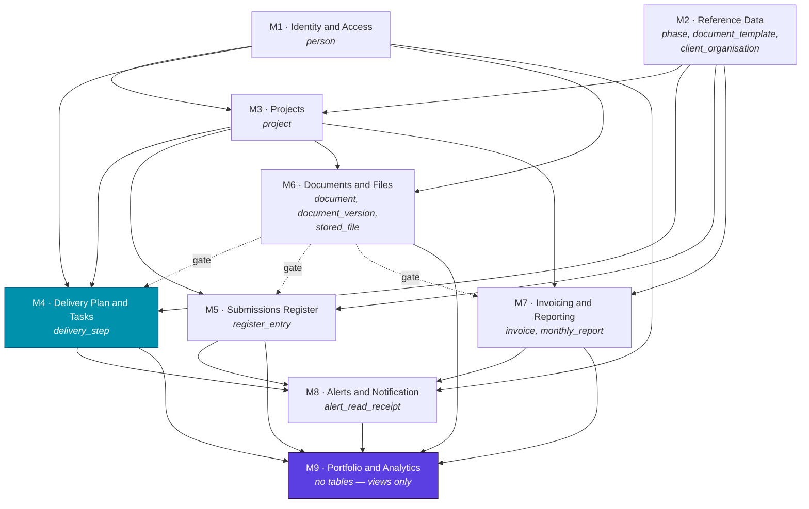

# Build Plan — DRAFT PROPOSAL

**Status: DECISIONS APPLIED — 2026-09-10. Still a proposal for approval.**

All seventeen upstream decisions scheduled in §1.1 have been answered. Two of them
changed scope rather than confirming it: **AZ-D1** narrowed the access model, and
**ERD-D4** added a SharePoint integration to M6 that was in no plan.
`PHASE-0-DECISIONS.md` carries the reasoning.

Derived 2026-09-10 from `FRONTEND-INVENTORY.md`, `DATA-MODEL-DRAFT.md` and
`AUTHZ-MODEL-DRAFT.md`, all in this repo at commit `26ddc67`.

---

## 0. Preamble

### Its inputs were drafts. They have now been decided.

`DATA-MODEL-DRAFT.md` carried nine open decisions and `AUTHZ-MODEL-DRAFT.md` eight.
**All seventeen were answered on 2026-09-10** and both documents have been updated in
place. §1.1 below records the answers rather than scheduling the questions.

Three *new* decisions were raised by those answers and are open — they are in §1.3.

A third input was available and used: `AUTHZ-MODEL-DRAFT.md`, which is outside this
skill's stated two-input contract. It is cited wherever it contributed, so this
document can be audited against all three.

### A naming collision, and how this document avoids it

**The product owns the word "phase".** A REWATU delivery plan has ten of them —
*1 Initiation*, *2 Planning*, … *10 Training and support* (`reference.ts:4-8`) —
and they are domain data, with their own proposed table. A build plan naturally
wants the same word for its own stages.

So: the units of work here are **build modules, `M1`–`M9`**, and their sequencing
is called **build order** and **waves**. The word *phase*, unqualified, always means
a REWATU delivery phase. The word *module* has no domain meaning in this product —
verified, it appears nowhere in the reference lists, the templates or the README —
so it is safe.

### No estimates

This document carries no dates, no story points and no sizes. There is no team, no
velocity and no staffing information available to it, and a plan with sizes gets
quoted back as a commitment. What it carries instead: scope, dependencies,
port-versus-build split, acceptance criteria and risk.

### What is being planned

A backend for a frontend that has none. `FRONTEND-INVENTORY.md` §0 records the
wiring state as **NOT WIRED**: zero network calls, zero persistence, all state in a
single in-memory reducer. So no module is a pure port — **every** module includes
re-pointing the client, and §1.2 P1 asks who owns that.

Thirteen tables from `DATA-MODEL-DRAFT.md` §3 are distributed across nine build
modules. Every table lands in exactly one.

---

## 1. Decisions required

### 1.1 Upstream decisions — ALL ANSWERED

*Answered 2026-09-10. Full reasoning in `PHASE-0-DECISIONS.md`.*

| # | Decision | Answer | Effect on this plan |
|---|---|---|---|
| **ERD-D5** | Timezone | **SAST, server-side.** No DST in SA | Unblocks 7 modules. No change to scope |
| **AZ-D1** | Does assignment grant project access? | **No — read-only plan and own steps only** | **Narrows the access model. M6 gains step-scoped document rules** |
| **AZ-D2** | Does inactive revoke access? | **Locked out completely** | M1 gains session termination on deactivate |
| **ERD-D2** | Phase lookup table | **Yes** | M2 keeps its largest table |
| **ERD-D3** | Document→subject link | **Typed FKs, at most one, zero permitted** | M6 gains a CHECK; standalone documents are legal |
| **AZ-D5** | Who may pass a gate? | **Assignee for own step; PM/Lead for any** | Confirms M4, M5, M7 as planned |
| **ERD-D4** | Files: Blob or SharePoint? | **Both — Blob stores, SharePoint syncs** | **M6 gains a SharePoint integration in no plan** |
| **ERD-D7** | Client organisation | **Yes, a managed list** | M2 keeps the table |
| **ERD-D1** | Client-side people | **No — stay free text** | No `client_contact` table. M3 unchanged |
| **AZ-D7** | Audit columns | **Yes — created/updated by and at** | Four columns on five tables. M1 sets the pattern |
| **ERD-D6** | `'Not applicable'` submission | **Not added — dead branch removed** | M4 removes a branch from `stepFlag` |
| **AZ-D3** | Global document list scoped? | **Yes, per caller** | M6 gains the rule that never existed |
| **ERD-D8** | Person delete | **Soft delete** | M1 — deactivate is the path |
| **AZ-D4** | Lead-as-manager sees money? | **No — role decides the kind** | Confirms M7 |
| **AZ-D6** + **ERD-D9** | Project delete / archive | **Never delete. Archive only** | **M3 loses delete, gains archive** |
| **AZ-D8** | Client people as principals | **No** | No external tier. Out of scope confirmed |

**Nothing upstream now blocks a start.**

### 1.3 New decisions raised by those answers — OPEN

*These did not exist before the decisions above. They are the current blockers.*

| # | Question | Blocks | Why it matters |
|---|---|---|---|
| ~~N1~~ | SharePoint/Blob conflict | **ANSWERED: SharePoint wins.** Makes the integration **two-way** — M6 must detect SharePoint-side edits, not just push |
| ~~N2~~ | Sync or background? | **ANSWERED: background.** M6 gains a job queue, retries and a visible pending state |
| ~~N3~~ | Delete cascades to SharePoint? | **ANSWERED: no.** SharePoint keeps everything |
| ~~N4~~ | The folder-path fields | **ANSWERED: removed.** The app derives its own folder |
| ~~N5~~ | Who may archive? | **ANSWERED: Director + the project's manager** |
| ~~N6~~ | Project created in error | **ANSWERED: a `cancelled` state, separate from archived** |
| ~~N7~~ | Team-member header projection | **ANSWERED: name, client, PM name, lead name** |

### 1.4 Still open after round 2

| # | Question | Blocks |
|---|---|---|
| **O1** | A SharePoint-sourced version has no `uploaded_by` — null with a source flag, or resolve the SharePoint editor to a person? | M6 |
| **O2** | N1 pull-back vs N3 no-delete: a document deleted in the app still exists in SharePoint, and will look like a SharePoint-side change. **The pull-back must not resurrect it.** | M6 |
| **O3** | A SharePoint edit can replace evidence *after* a step was completed against it. Nothing contemplates this | M4, M6 |
| **O4** | What folder convention does the app use per project, now the free-text paths are gone? | M6 |
| **O5** | Who may cancel a project, and is it reversible? Recommend Director-only and reversible | M3 |

**O2 is a real bug waiting to happen** — it sits exactly at the join between two answers
that are individually correct.

### 1.2 This plan's own decisions

*Numbered separately: different owner, different deadline.*

**P1 — Is the frontend kept and re-pointed, or rewritten?**
`FRONTEND-INVENTORY.md` §0 and §2 establish there is **no network layer at all** —
not an outdated one, none. So "re-point the client" is not a mechanical find-and-replace
in one file; it is introducing an entire data-fetching layer, loading and error states,
optimistic updates and cache invalidation into 58 files that have never had any. This
work exists in **every** module and it currently has no owner.

Recommendation: keep the frontend — it is complete, accessible and behaviourally rich
(`FRONTEND-INVENTORY.md` §8) — and treat the re-point as a named workstream with its
own owner, not as a tail task inside each module.

**P2 — Who builds the surfaces that were never built?**
§6 lists four subsystems with no UI at all. These cannot be ported; they are new
product, and at least two of them (reference-data authoring, alert delivery) have no
design. Recommendation: decide per item in §6 whether it is in scope for v1 at all.

**P3 — Does Settings survive as one screen?**
`/settings` is one route serving two unrelated subsystems — the people roster (M1) and
the read-only standard template and reference lists (M2). Recommendation: keep the
route, serve its tabs from two modules, and accept that it is the one screen whose
completion spans two modules.

**P4 — Does Excel export stay client-side?**
`FRONTEND-INVENTORY.md` §8 records a dependency-free OOXML writer (`src/lib/xlsx.ts`,
197 lines) generating real `.xlsx` in the browser from in-memory state. Once state is
server-side, either the client fetches everything in order to export — which
re-introduces the unscoped-read problem `AUTHZ-MODEL-DRAFT.md` H6 warns about — or
export moves server-side and the OOXML work is redone. Recommendation: move export
server-side, where the row scoping already lives.

**P5 — Does the app remain deployable as a claude.ai artifact?**
`FRONTEND-INVENTORY.md` §8 records a host bridge to `window.claude.use('downloads')`
and a `VITE_HASH_ROUTER` single-file build mode. The in-memory architecture is a
consequence of that origin. A backend is incompatible with that deployment target.
Recommendation: confirm the artifact build is being retired, or the two targets diverge
permanently and someone must maintain both.

---

## 2. The module map



Solid edges are foreign keys crossing a module boundary (`DATA-MODEL-DRAFT.md` §2).
**Dotted edges are the three business gates** — a behavioural dependency, not an FK,
and the reason M6 is built earlier than its own FKs would suggest. See §4.

`M4` (highlighted) is the reference module — §5. `M9` is the terminal aggregation
module — it owns no tables.

### The boundary that cuts awkwardly

`document.invoice_id → invoice` puts M6 downstream of M7, while `GATE_INVOICE`
requires a document to exist before an invoice may be submitted, putting M7
downstream of M6. **That is a cycle**, and the same cycle exists between M6 and both
M4 and M5.

Proposed resolution, and it is a proposal: **M6 ships `document` carrying only
`project_id`.** Each of M4, M5 and M7 then adds its own subject FK column
(`step_id`, `register_entry_id`, `invoice_id`) and its own gate as part of its own
work. This breaks all three cycles, keeps each gate with the module that owns the
rule, and means M6 does not wait on three downstream modules. The cost is that
`document`'s schema is completed by four modules rather than one, and `DATA-MODEL-DRAFT.md`
§3.3's CHECK constraint — at most one subject FK non-null — can only be added last.

---

## 3. The modules

### M1 · Identity and Access

**Purpose.** Who someone is, and the mechanism by which any other module knows.

**Screens.** `/settings` (people tab only — see P3). No login screen exists anywhere.

**Tables owned.** `person`.

**Operations.** `person` list, read, create, update, deactivate, delete
(`FRONTEND-INVENTORY.md` §5). Plus authentication, which has no operations today
because it does not exist.

| Work | Port or build |
|---|---|
| Person CRUD and the roster screen | **Port** — the screen exists and works |
| Deactivate / reactivate | **Port** — control exists (`DATA-MODEL-DRAFT.md` §3.1) |
| Authentication, sessions, credentials, password reset | **Build from nothing** — `AUTHZ-MODEL-DRAFT.md` §6 |
| The authorization *mechanism* every later module calls | **Build from nothing** |
| `uploaded_by` name→id resolution | **Build** — migration, `DATA-MODEL-DRAFT.md` H2 |

**Dependencies.** None. Foundational.

**Contingent on.** AZ-D2, AZ-D7, ERD-D8.

**Acceptance criteria.**
1. **The headline:** identity cannot be selected by the client. Today a user picks who
   they are from a dropdown (`FRONTEND-INVENTORY.md` §4); after M1, becoming a
   different person requires re-authenticating.
2. An unauthorised role receives a 403 from the API, not a client-side redirect.
3. A credential is hashed at rest and never compared in the clear.
4. Deactivating a person terminates their existing session, not only future logins
   (contingent on AZ-D2).
5. Lowering someone's `access_role` takes effect without waiting for token expiry.

**Risks.** This module is the whole of `AUTHZ-MODEL-DRAFT.md` H1 — until it lands,
every route and mutation in the system is open. It is also the module with the least
existing code to guide it: there is no login screen, no credential field and no session
anywhere to port. **One relief:** because no credentials exist, none are compromised
(`AUTHZ-MODEL-DRAFT.md` §6) — there is no credential migration.

---

### M2 · Reference Data

**Purpose.** The controlled vocabularies and the standard delivery template — the
content that makes a new project arrive fully formed.

**Screens.** `/settings` (standard template and reference-list tabs). **Read-only
today** — verified: `DELIVERY_PLAN_TEMPLATE` and `SUBMISSIONS_TEMPLATE` are imported
into `Settings.tsx` and only ever rendered (`.map`, `.filter`, `.length`), and
`AppStore.tsx` contains **no reducer action** for phase, template or client.

**Tables owned.** `phase`, `document_template`, `client_organisation`.

| Work | Port or build |
|---|---|
| Serving the 10 phases and the 77 template rows | **Port** — data exists, verbatim, in `templates.ts` |
| Migrating the standard template | **Build** — 77 rows of real domain content |
| **Authoring surfaces for all three tables** | **Build from nothing** — see §6 |
| Reconciling the three phase representations | **Build** — ERD-D2 |

**Dependencies.** None.

**Contingent on.** ERD-D2 (existential — without it there is no `phase` table),
ERD-D7 (existential for `client_organisation`).

**Acceptance criteria.**
1. **The headline:** renaming a phase does not break anything. Today the register→plan
   join is a string prefix match — `steps.filter(s => s.phase.startsWith(\`${e.phase} \`))`
   (`DATA-MODEL-DRAFT.md` D2) — and a rename silently returns nothing.
2. A project created after a template change gets the new template; existing projects
   keep the copy they were created from (`FRONTEND-INVENTORY.md` §8: *"editing a
   project's own copy never changes it"*).
3. The 77 template rows round-trip byte-identically through the migration.

**Risks.** The authoring surfaces are new product with no design (P2). ERD-D2 could
remove this module's largest table.

---

### M3 · Projects

**Purpose.** The project record, its setup, and creation from the standard template.

**Screens.** `/projects`, `/projects/new`, `/projects/:id/setup`.

**Tables owned.** `project`.

**Operations.** create, read, list, update, **archive** (`FRONTEND-INVENTORY.md` §5).
**Delete is removed** — AZ-D6/ERD-D9: projects are never deleted.

| Work | Port or build |
|---|---|
| Project CRUD, list, setup form, 5-step wizard | **Port** |
| The 78-row transactional create | **Port**, but the transaction is new — see below |
| Row-scoped listing (`VISIBLE`) | **Build** — `AUTHZ-MODEL-DRAFT.md` §5 |
| Money-column projection | **Build** — `AUTHZ-MODEL-DRAFT.md` §4 |
| **Project archiving** | **Build from nothing** — now the ONLY disposal route (AZ-D6/ERD-D9) |
| **A three-state `status`: active / archived / cancelled** | **Build** — N6 replaces the `archived` boolean |
| Team-member header projection | **Build from nothing** — new, from AZ-D1. See N7 |
| Audit columns | **Build** — AZ-D7 |

**`project/create` is a cross-module transaction.** It creates the project **plus 55
delivery steps plus 22 register entries**, scheduled across the contract term
(`FRONTEND-INVENTORY.md` §5). Those rows belong to M4 and M5. So M3 either owns a
transaction that writes into two other modules' tables, or the create is orchestrated.
This is the plan's clearest boundary tension and it should be settled when M3 starts.

**Dependencies.** M1 (`project_manager_id`, `project_lead_id` → `person`),
M2 (`client_id` → `client_organisation`, and the template it instantiates).

**Contingent on.** ERD-D5, ERD-D1, ERD-D7, ERD-D9, AZ-D1, AZ-D6.

**Acceptance criteria.**
1. **The headline:** a project created by one person is visible to another person, on
   another device, after both have logged out and back in. Today nothing survives a
   page reload (`FRONTEND-INVENTORY.md` §3).
2. Creating a project yields exactly 78 rows or zero — never a project with a partial
   plan.
3. A Team member listing projects receives only projects they are on, and the response
   body contains no `contract_value`, `cost_budget` or `cost_to_date`.
4. **Nobody can delete a project** — the endpoint does not exist. Archiving is the only
   disposal route, and an archived project disappears from every default listing.
5. A Team member reading a project receives the header projection only — no contract refs,
   no document locations, no workbook dates, no money (AZ-D1).

**Risks.** The cross-module transaction above. `project` is the widest table in the
model at 26 columns (`DATA-MODEL-DRAFT.md` §3.2), and it carries three of the ERD's
open decisions at once.

---

### M4 · Delivery Plan and Tasks — **the reference module**

**Purpose.** The 55-step plan per project, and the personal task view over it. The
product's centre of gravity.

**Screens.** `/projects/:id/plan`, `StepEditor`, `/tasks`.

**Tables owned.** `delivery_step`. Adds `document.step_id` (§2).

**Operations.** list, read, create, update, update-bulk, duplicate, delete, reorder,
transition-status (`FRONTEND-INVENTORY.md` §5) — the richest operation set in the system.

| Work | Port or build |
|---|---|
| Step CRUD, inline editing, the 19-column grid | **Port** |
| Fractional insert + `renumber()` ordering | **Port** — non-trivial, `FRONTEND-INVENTORY.md` §5 |
| Phase-scoped reorder | **Port** |
| `stepFlag` — the core rule, 8 outcomes | **Port**, must move server-side |
| Task buckets, `nextAction` | **Port** — views over the same table |
| `GATE_STEP` as a transactional invariant | **Build** — `AUTHZ-MODEL-DRAFT.md` §5 |
| `ASSIGNED` row-level rule | **Build** |
| Migration of 220 seeded steps | **Build** |

**Dependencies.** M1 (`assignee_id`), M2 (`phase_id`), M3 (`project_id`),
M6 (gate — dotted edge).

**Contingent on.** ERD-D5, ERD-D6 (the `'Not applicable'` branch sits inside
`stepFlag`), AZ-D1, AZ-D5.

**Acceptance criteria.**
1. **The headline:** two people see genuinely different task lists from the same data.
   Today every user reads the same in-memory graph.
2. A step with a required submission cannot be marked Completed without evidence — and
   the refusal comes from the server, with the same explanatory message, not from the
   form.
3. All 38 assertions in `scripts/verify-rules.ts` pass against the server
   implementation of `stepFlag`, `daysLate` and the gates
   (`DATA-MODEL-DRAFT.md` H6).
4. Two people reordering the same phase concurrently do not corrupt `position`.
5. A Team member can update their own assigned step and receives 403 on any other step
   in the same project.

**Risks.** Carries the system's defining rule, so a defect here is a product defect
rather than an inconvenience. The ordering machinery is the most intricate logic in the
codebase. ERD-D6 is unresolved *inside* the core rule.

---

### M5 · Submissions Register

**Purpose.** The 22-entry contractual submission register per project — what was sent
to the client and what came back acknowledged.

**Screens.** `/projects/:id/submissions`.

**Tables owned.** `register_entry`. Adds `document.register_entry_id`.

| Work | Port or build |
|---|---|
| Register CRUD, inline editing | **Port** |
| `GATE_REGISTER` | **Build** |
| Tightening `owner` from `string` to the `Responsible` enum | **Build** — `DATA-MODEL-DRAFT.md` §3.2 |
| Migration of 88 seeded entries | **Build** |
| Ability-level authorization | **Build** — absent today (`AUTHZ-MODEL-DRAFT.md` §7 row 9) |

**Dependencies.** M2 (`phase_id`, `template_id`), M3 (`project_id`), M6 (gate).

**Contingent on.** ERD-D2, ERD-D5, AZ-D5.

**Acceptance criteria.**
1. **The headline:** a register entry cannot be marked Submitted without an attached
   file — enforced by the write path, so an API call bypassing the UI is refused too.
2. `owner` rejects a value outside the `Responsible` enum at the database, not the form.
3. A Team member on the project can read the register and receives 403 on every write.

**Risks.** Low relative to its siblings — it is structurally the simplest of the four
resource modules, which is part of why M4 rather than M5 is the reference.

---

### M6 · Documents and Files

**Purpose.** Document records, their version history, and the actual bytes.

**Screens.** `/documents`, `/projects/:id/documents`, the upload dialog.

**Tables owned.** `document`, `document_version`, `stored_file`.

| Work | Port or build |
|---|---|
| Document records, metadata, version history | **Port** |
| Server-assigned version numbering | **Port** — contract already specified (`FRONTEND-INVENTORY.md` §5) |
| **File transport, storage and retrieval (Azure Blob)** | **Build from nothing** — see §6 |
| **SharePoint sync on upload** | **Build from nothing — in NO upstream plan.** ERD-D4 |
| **Two-way sync: detect SharePoint-side edits and pull them back** | **Build from nothing.** N1 — Graph change notifications or polling. Larger than the push |
| **Background job queue with retries, and a visible "not yet in SharePoint" state** | **Build from nothing.** N2 |
| Scoping the global document list | **Build** — no guard predicate existed at all (AZ-D3) |
| **Step-scoped document rules for Team members** | **Build** — new, from AZ-D1 |
| The at-most-one-subject CHECK, zero permitted | **Build** — ERD-D3 |
| `uploaded_by` name→id resolution | **Build** — `DATA-MODEL-DRAFT.md` H2 |

**Dependencies.** M1 (`uploaded_by_id`), M3 (`project_id`).
**Depended on by** M4, M5, M7 for their gates — which is why it is built before them.

**Contingent on.** **N1–N4 in §1.3** — all four change this module's shape and are open.
ERD-D3, ERD-D4 and AZ-D3 are answered: `stored_file` exists, Blob holds the bytes, and
SharePoint is synchronised on upload.

**This module grew.** It was already the one with the most never-built work. ERD-D4 added
an integration with an external system, its auth, its failure modes and its conflict
policy; AZ-D1 replaced a simple project-scoped read rule with a step-scoped one. Both
landed after the plan was written.

**Acceptance criteria.**
1. **The headline:** an uploaded file survives a page reload and is retrievable by a
   different person on a different device. Today files are `blob:` URLs in one tab's
   memory (`FRONTEND-INVENTORY.md` §8) and seeded documents have no bytes at all.
2. A file at the 25 MB cap uploads, persists and downloads intact.
3. Upload progress reflects real transfer — today it is a `setInterval` animation
   (`FRONTEND-INVENTORY.md` §8).
4. A Team member sees **only documents attached to steps assigned to them** — a signed
   contract with no subject attached reaches them not at all (AZ-D1, ERD-D3).
5. A file uploaded in the app appears in the project's SharePoint folder without anyone
   copying it by hand (ERD-D4).
5. Uploading a new version supersedes the previous one without losing it, and the
   version number is assigned by the server.

**Risks.** The only module whose central capability does not exist in any form —
there is a real upload control with no transport behind it. ERD-D4 could remove most of
it. Three other modules wait on its gate.

---

### M7 · Invoicing and Reporting

**Purpose.** Invoices and statutory monthly reports — the money side of a project.

**Screens.** `/projects/:id/reports`.

**Tables owned.** `invoice`, `monthly_report`. Adds `document.invoice_id`.

| Work | Port or build |
|---|---|
| Invoice CRUD, monthly report lodging | **Port** |
| `GATE_INVOICE` | **Build** |
| Money projection and role denial | **Build** — unenforced today (`AUTHZ-MODEL-DRAFT.md` H4) |
| `(project_id, month)` uniqueness | **Build** — client-side only today |
| **Monthly report deletion** | **Build from nothing** — see §6 |
| Dropping `progressReportAttached` | **Build** — `DATA-MODEL-DRAFT.md` §6 |

**Dependencies.** M2 (`linked_phase_id`), M3 (`project_id`), M6 (gate).

**Contingent on.** ERD-D5, AZ-D4.

**Acceptance criteria.**
1. **The headline:** a Project lead who is a member of the project receives 403 on
   every invoice endpoint, and the project projection they receive contains no money
   fields. Today they reach `/projects/:id/reports` by URL and see everything
   (`AUTHZ-MODEL-DRAFT.md` §7 row 11).
2. An invoice cannot be marked Submitted without a progress report — server-enforced.
3. A second monthly report for the same project and month is rejected by the database.
4. `progressReportAttached` and the linked document can no longer disagree, because
   only one of them exists.

**Risks.** Carries the sharpest confidentiality requirement in the system. AZ-D4 is
subtle enough that a wrong answer is unlikely to be noticed in testing.

---

### M8 · Alerts and Notification

**Purpose.** The 13 derived alert kinds, per-person read state, and delivering alerts
to people who are not looking at the screen.

**Screens.** The bell in `TopBar`, and the "what needs you today" panel. No dedicated
route.

**Tables owned.** `alert_read_receipt`.

| Work | Port or build |
|---|---|
| The 13 alert derivations | **Port** — `alerts.ts`, fully specified |
| Per-person read receipts | **Build** — replaces a global array |
| **Delivery: email, daily digest, push** | **Build from nothing** — see §6 |
| Receipt pruning | **Build from nothing** — no rule exists (`DATA-MODEL-DRAFT.md` §3.5) |

**Dependencies.** M1 (`person_id`), and M4, M5, M7 for the records alerts derive from.

**Contingent on.** ERD-D5 — every alert threshold is a date comparison.

**Acceptance criteria.**
1. **The headline:** an alert marked read by one person remains unread for another.
   Today `readAlertIds` is a single global array and marking one read marks it read for
   everyone (`DATA-MODEL-DRAFT.md` §3.5).
2. An alert disappears when its cause is fixed, without any explicit dismissal —
   preserving the current derived-not-stored property.
3. Alerts are addressed by `forPersonIds`, and a person receives no alert for a project
   they cannot see.

**Risks.** Delivery is new product with no design, and it is the item most likely to be
descoped — the README already calls it *"the natural next step once a backend exists"*.
The two undocumented alert thresholds (`waiting > 14`, `toEnd <= 30`) surface here.

---

### M9 · Portfolio and Analytics — terminal aggregation

**Purpose.** Every cross-project view: the portfolio dashboard, the reports screen, the
calendar, and the per-project dashboard.

**Screens.** `/` , `/reports`, `/calendar`, `/projects/:id` (dashboard).

**Tables owned.** **None.** Its content is the ERD's views
(`DATA-MODEL-DRAFT.md` §4): `project_metrics`, `portfolio_metrics`, `cash_position`,
`phase_progress`, `calendar_event`, `project_health`.

| Work | Port or build |
|---|---|
| Every metric and chart | **Port** — `derive.ts` is fully specified |
| Caller-scoped aggregation | **Build** — the defect behind `AUTHZ-MODEL-DRAFT.md` H4 |
| Confirming four undocumented thresholds | **Build** — needs a human, see §7 |

**Dependencies.** M4, M5, M6, M7, M8 — everything it aggregates.

**The tension, named.** `/` is the landing page. This module therefore carries the
highest perceived priority and the strictest dependency in the plan simultaneously, and
there will be pressure to pull it forward. **The workable answer is to serve each panel
from its own module as that module lands**, and treat M9 as where panels are assembled
rather than where they are invented. A portfolio dashboard with three of six panels live
is a better intermediate state than a stubbed one.

**Contingent on.** ERD-D5, AZ-D1 — plus the four undocumented thresholds.

**Acceptance criteria.**
1. **The headline:** a Director and a Project manager see genuinely different portfolio
   totals from the same data, and the Project manager's totals equal the sum over only
   their own projects. Today every aggregate is computed over every active project and
   only the per-project list is filtered (`FRONTEND-INVENTORY.md` finding 1).
2. A Team member receives 403 on `/reports`, not a hidden nav link.
3. Every figure on the dashboard is derived at read time — no stored aggregate can be
   stale relative to its underlying rows.
4. `SCHEDULE_SLACK`, the Due-soon window, and the two alert thresholds are documented
   values, not literals.

**Risks.** Highest schedule pressure, latest position, and it is where every undefined
business rule surfaces. Depends on five modules.

---

## 4. Build order

### The critical path

```
M1 Identity ──▶ M2 Reference ──▶ M3 Projects ──▶ M6 Documents ──▶ M4 Delivery ──▶ M9 Portfolio
```

Six modules deep. **M6 sits earlier than its own foreign keys suggest** because M4, M5
and M7 all need its gate (§2).

**M6 also grew after this order was set — twice.** ERD-D4 added the SharePoint
integration, AZ-D1 narrowed its read rules, and then N1 made the integration **two-way**
while N2 added a job queue. It is now both the largest module and the one three others
wait on — the single biggest schedule risk in the plan, and worth reviewing before
committing to this order.

### Waves

| Wave | Modules | Why together |
|---|---|---|
| 1 | **M1**, **M2** | No dependencies. M2 does not depend on M1 — genuinely parallel |
| 2 | **M3** | Needs M1 and M2 |
| 3 | **M6** | Needs M3. Pulled ahead of M4/M5/M7 for the gates |
| 4 | **M4**, **M5**, **M7** | All three need M3 and M6, and none needs the others. **The widest parallel wave** |
| 5 | **M8** | Needs the records from wave 4 |
| 6 | **M9** | Needs everything |

**M2 and M1 in parallel** is the only parallelism available before wave 4, and it is
real: `phase`, `document_template` and `client_organisation` have no FK to `person`.

**Wave 4 is where the reference module pays off.** Three structurally similar modules
built at once — which is exactly why M4's shape must be settled before they start, and
why M4 leads the wave rather than sharing it. See §5.

### What is not on the path

The frontend re-point (P1) runs alongside every module and is not a wave. Migration is
distributed (§7). Alert *delivery* (M8) can be descoped entirely without blocking M9.

---

## 5. The reference module

**M4 · Delivery Plan and Tasks.**

**Not the first module by dependency order.** M1 is first, and it is the worst possible
reference: authentication, sessions and credentials teach a later resource module
nothing. M2 is worse still — three lookup tables with no ordering, no gates and no
role scoping.

**Why M4.** It exercises more of the patterns wave 4 needs than any other module:

| Pattern | Where M4 exercises it |
|---|---|
| Ordinary CRUD | Step create, read, update, delete |
| Parent→child with an invented FK | `delivery_step.project_id` |
| Ordering that must survive concurrent writes | Fractional insert, `renumber()`, phase-scoped reorder |
| A row-level rule reaching an individual row | `ASSIGNED` — `assignee_id`, not project membership |
| A transactional invariant on a status change | `GATE_STEP` |
| A derived view over an owned table | Tasks, buckets, `nextAction`, `stepFlag` |
| Cross-module document linkage | `document.step_id` |
| Bulk mutation | `step/updateMany` |
| A real data migration | 220 seeded rows |
| An enum decision resolved mid-build | ERD-D6 |

It is also the product's core, so the module where a wrong shape costs most.

**What M4 does not exercise** — each must be established deliberately elsewhere rather
than improvised the first time it is needed:

| Pattern | Not in M4 | Establish in |
|---|---|---|
| Column-level role denial (money) | `delivery_step` has no money | **M3** — first module with money columns |
| File transport and byte storage | Links to documents, stores none | **M6** |
| A cross-module transaction | Its 55 rows are created *by* M3 | **M3** — the 78-row wizard create |
| Outbound delivery (email, push) | Alerts render in-app | **M8** |
| Compound uniqueness | No natural unique key | **M7** — `(project_id, month)` |
| Immutable append-only history | Steps are freely mutable | **M6** — `document_version` |

**Sequencing consequence.** M3 must establish the money-projection pattern before wave
4, and M6 must establish file handling before wave 4 — both already sit earlier on the
path, so the order holds. But it means **M3 and M6 are not merely dependencies of wave
4; they are pattern-setters too**, and should be reviewed with that in mind.

---

## 6. Work never built

*The inverse gap — derived by cross-referencing `FRONTEND-INVENTORY.md` §5's operation
set against `DATA-MODEL-DRAFT.md` §3's table list, then confirming each absence
positively. This is not a port. It is new product, and it has no design.*

| # | Never built | Evidence | Lands in |
|---|---|---|---|
| 1 | **Authentication in full** | No login screen, credential, session or token anywhere (`FRONTEND-INVENTORY.md` §4) | **M1** |
| 2 | **File transport, storage and retrieval (Azure Blob)** | Real upload control; `URL.createObjectURL` into memory; progress is a `setInterval` (`FRONTEND-INVENTORY.md` §8) | **M6** |
| 2b | **SharePoint sync integration** | **Added by decision ERD-D4, not found in the code.** Auth, target folder per project, conflict policy, failure handling — none of it exists or is designed | **M6** |
| 3 | **Reference-data authoring** — phases, standard template, document templates, client organisations | Confirmed: `AppStore.tsx` has **no reducer action** for phase, template or client; `Settings.tsx` only renders them | **M2** |
| 4 | **Alert delivery** — email, daily digest, push | 13 alert kinds render in-app only; README names it the next step | **M8** |
| 5 | **Project archiving** | `project.archived` is read in 8 places and set to `true` nowhere. **Now required scope, not a gap — it is the only disposal route (AZ-D6/ERD-D9)** | **M3** |
| 6 | **Monthly report deletion** | `report/add` and `report/update` exist; no delete (`FRONTEND-INVENTORY.md` finding 7) | **M7** |
| 7 | **Alert receipt pruning** | Receipts can outlive the derived alerts they reference; no rule exists (`DATA-MODEL-DRAFT.md` §3.5) | **M8** |
| 8 | **Audit columns** | One actor-attribution column in the whole schema (`AUTHZ-MODEL-DRAFT.md` H11) | **M1** sets pattern; all modules carry |

**Items 1, 2, 2b, 3 and 4 are substantial subsystems.** A reader who believes they are looking at a
port of an existing application will underestimate all four. Items 5–7 are small but
each is a real gap that will otherwise be discovered by a user.

**On the strength of this evidence.** Items 1, 2, 5, 6 are positive findings — the
absence is visible in the code that *does* exist. Item 3 is the strongest of the
"absence" findings: zero reducer actions across three entities, confirmed by a direct
search of the action union, plus display-only rendering in the one screen that touches
the data. Items 4, 7, 8 rest on the upstream documents rather than on a fresh search.
**One overlooked component moves work between the port and build columns**, and the
split should be re-confirmed when each module starts.

---

## 7. Cross-cutting concerns

*Not modules. Assigning one of these to a single module is how it gets skipped.*

**Authorization.** M1 provides the mechanism — sessions, role lookup, the policy
layer. **Every module ships its own rules**: its row-level scoping, its projections, its
403s. `AUTHZ-MODEL-DRAFT.md` §4's matrix is per-resource, so it decomposes cleanly, but
no module inherits enforcement from another.

**Migration.** Distributed. Each module carries its share of `DATA-MODEL-DRAFT.md` §8:

| Hazard | Carried by |
|---|---|
| H1 — ID collision on import | Every module |
| H2 — `uploaded_by` name→id resolution, not automatable | M6 (with M1) |
| H3 — empty string is not NULL, ~20 date columns | Every module with dates |
| H4 — `order` is a reserved word | M4, M5 |
| H5 — `period_covered` is prose, needs human interpretation | M7 |
| H6 — the three gates become transactional invariants | M4, M5, M7 |
| H7 — timezone | Every module |
| H8 — no uniqueness exists today | M1, M6, M7, M8 |

**The frontend re-point.** Runs through every module. Currently unowned — P1.

**Undefined business rules.** Each needs a human; none can be inferred:

| Rule | Value today | Needed by |
|---|---|---|
| `SCHEDULE_SLACK` | `5` percentage points, undocumented | M9 |
| Due-soon window | `daysToEnd <= 7` — the one the README publishes | M4 |
| Awaiting-acknowledgement escalation | `waiting > 14` days | M8 |
| Contract-ending warning | `toEnd <= 30` days | M8 |
| `'Not required'` vs `'Not applicable'` | Two members, possibly one state | M4 |
| Alert receipt retention | No rule | M8 |

**Export.** P4 — currently client-side OOXML generation over unscoped in-memory state.
Touches M9 primarily but every module that offers a download.

---

## 8. Confidence

### Limits inherited from the inputs

`FRONTEND-INVENTORY.md` §9 caps everything here, and its limits propagate:

- **The application was never built or run.** Every claim in all three inputs, and
  therefore in this plan, is a static read. The port/build split in particular has never
  been checked against running behaviour.
- **Fixture bodies were not read row by row.** Migration scope per module — 220 steps,
  88 register entries — is a count, not an inspection.
- **Git history was not consulted** beyond four commit subject lines.

Both drafts are unreviewed. **Seventeen open decisions sit upstream of this plan**, and
§1.1 schedules rather than resolves them. If the ERD review changes an answer, the
modules listed against that decision change with it — ERD-D2 and ERD-D4 are each
existential for a table this plan assigns.

### What this plan did not attempt

- **No estimates, dates, sizes or staffing** — stated in §0 and excluded deliberately.
- **No framework, language or datastore choice.** `FRONTEND-INVENTORY.md` §8 implies
  none for the server and that choice is not this document's.
- **No API contract.** `FRONTEND-INVENTORY.md` §5 sketched the operations; the contract
  is a separate phase.
- **No test strategy** beyond naming `scripts/verify-rules.ts` as an existing
  conformance suite for M4.
- **No client-portal scope.** AZ-D8 — if client-side people become principals, the
  module map changes shape rather than extending.

### Weakest parts, ranked

1. **The M3 cross-module transaction.** `project/create` writes 78 rows into three
   modules' tables. I have named the tension rather than resolved it, and it is the
   boundary most likely to move on review.
2. **The M6-first ordering.** Placing Documents ahead of Delivery, Register and
   Invoicing is a proposal driven by the three gates, and it inverts the intuitive
   order. If the gates were deferred, M6 could move later and wave 4 could start sooner.
3. **M4 as the reference module.** M4 is the richest, but its fractional-ordering
   machinery is atypical — nothing else in the system needs it. A reviewer might
   reasonably prefer M5 as a cleaner template and accept a less representative one.
4. **Where `/tasks` belongs.** It reads from three subsystems, which by the aggregation
   test would place it in M9. I assigned it to M4 because it owns no tables of its own
   and is a personal view over `delivery_step`. Defensible either way.
5. **Item 3 in §6** rests on evidence of absence. Strong evidence — no reducer action
   exists for any of the three entities — but absence nonetheless.

### An error in an input document

**None found in this pass.** `AUTHZ-MODEL-DRAFT.md` §9 already records a correction to
`FRONTEND-INVENTORY.md` §1 — that routes 9, 10 and 11 are marked "No — none" for access
enforcement when membership is in fact enforced by their parent layout. That correction
stands and is not repeated here beyond this pointer; §3 M5, M6 and M7 use the corrected
reading.

### Complete

All thirteen tables from `DATA-MODEL-DRAFT.md` §3 are assigned to exactly one module.
All fourteen routes from `FRONTEND-INVENTORY.md` §1 are accounted for, including
`/settings`, which is split across M1 and M2 (P3). No module is unplanned.
